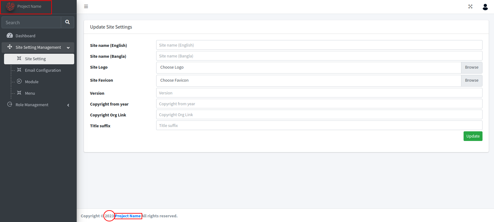
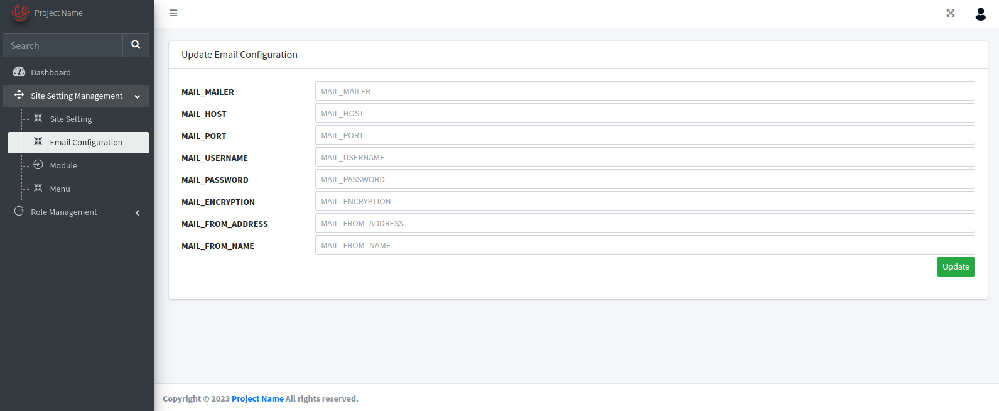
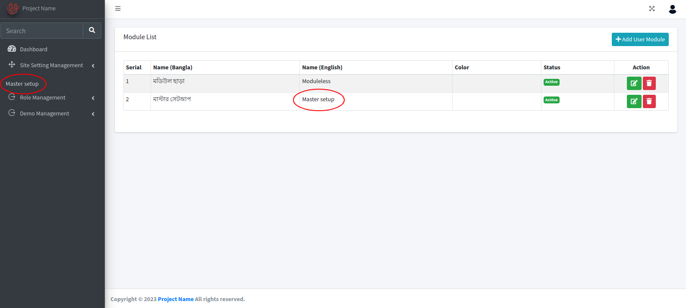
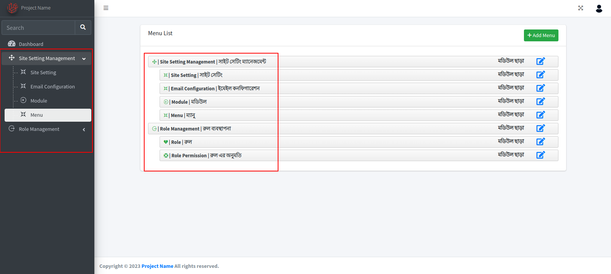
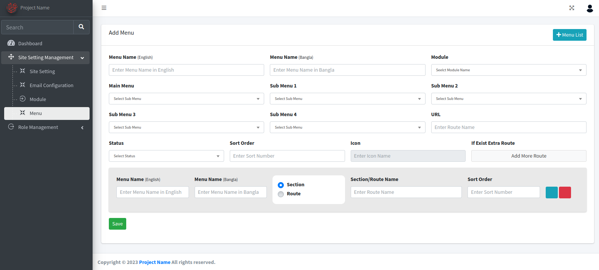
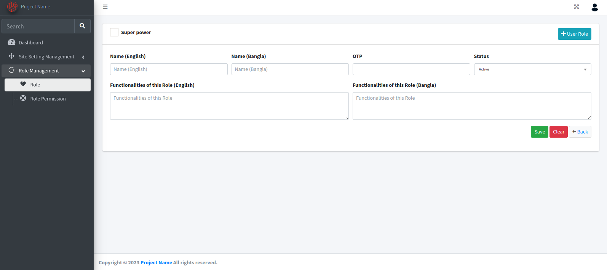
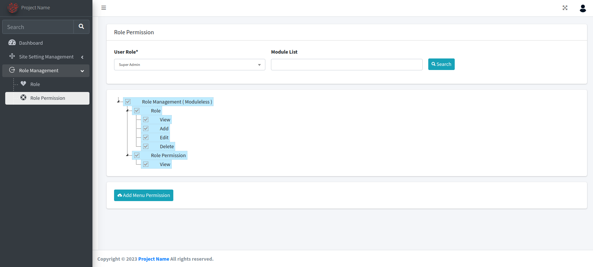
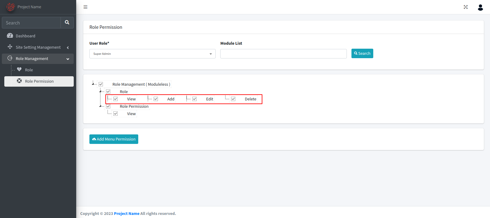

 <h1 align='center'>Admin panel</h1>

<h3>Index</h3>

- **[Installation](#Installation)**
- **[User Crendential](#UserCrendential)**
- **[Site Setting](#SiteSetting)**
- **[Email Configuration](#EmailConfiguration)**
- **[Module](#Module)**
- **[Menu](#Menu)**
- **[Role](#Role)**
- **[Menu Permission](#MenuPermission)**

 <h3 id="Installation">Installation</h3>

Clone git repository to local storage
```
git clone https://github.com/baoundoly/demoWebsiteLaravel.git
```
Create .env file & need .env file updated
```
cp .env.example .env
```
```
DB_CONNECTION=mysql
DB_HOST=127.0.0.1
DB_PORT=3306
DB_DATABASE=admin_panel
DB_USERNAME=root
DB_PASSWORD=
```
Key to generate in .env
```
php artisan key:generate
```
Migrate database and get all dependency tables with data
```
php artisan migrate
```
To run test project at [localhost:8000](http://localhost:8000)
```
php artisan serve
```
<h3 id="UserCrendential">User Crendential</h3>

```
email - dev@nanoit.biz
password - dev@nano
```

<h3 id="SiteSetting">Site Setting</h3>



<h3 id="EmailConfiguration">Email Configuration</h3>



<h3 id="Module">Module</h3>



<h3 id="Menu">Menu</h3>





<h3 id="RoleAdd">Role</h3>



<h3 id="MenuPermission">Menu Permission</h3>

#### grid line



#### Inline


